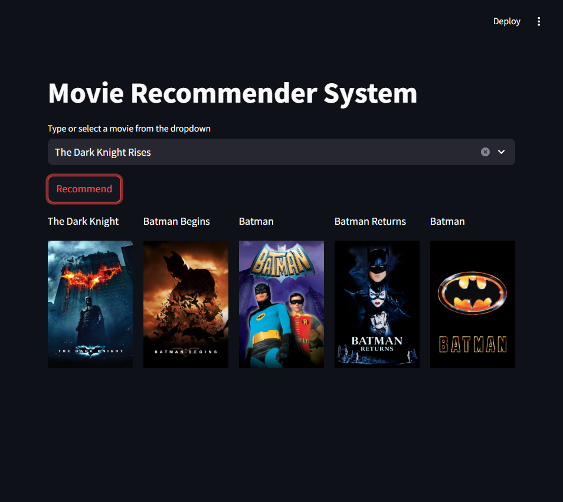
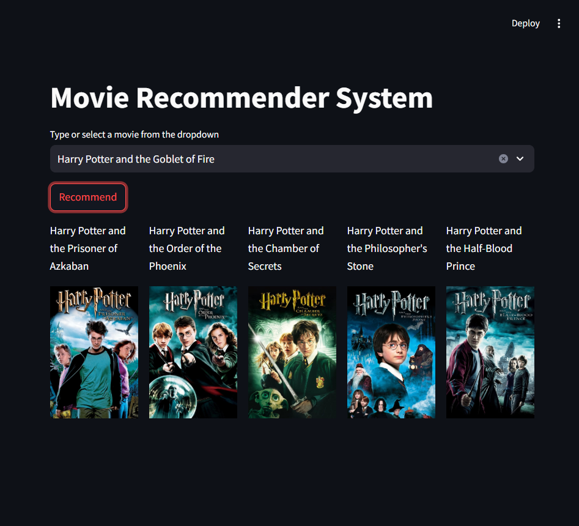

# 📽️ Movie Recommender System


## 📌 Introduction
Recommendation systems play an increasingly crucial role in today’s digital world. People are often short on time, and these systems help streamline their decision-making process by offering personalized suggestions. 

The primary objective of a recommendation system is to search for relevant content tailored to an individual’s preferences. These systems utilize **Artificial Intelligence (AI)** algorithms to analyze available data and create customized suggestions based on user behavior, interests, and interactions.

## 🔥 Types of Recommendation Systems

### 1️⃣ Content-Based Filtering
- Content-based recommendation systems rely on item attributes and user preferences.
- Platforms like **YouTube, Spotify, and Netflix** use this approach.
- The system **generates embeddings** based on features like genre, director, and actors.
- If a user likes a particular movie, similar movies are recommended based on shared characteristics.
- **Drawback**: Over-specialization can occur, meaning recommendations may become too repetitive.

### 2️⃣ Collaborative Filtering
- Collaborative filtering recommends items based on **user-item interactions**.
- It **clusters users** with similar tastes and provides suggestions based on their collective behavior.
- Commonly used in **book recommendations, online shopping platforms, and movie streaming services**.
- The system relies on **ratings, reviews, and watch history**.
- **Challenges**:
  - Computationally expensive due to the **user-item matrix**.
  - Popular movies get recommended frequently, making it hard for **new movies** to gain visibility.

### 3️⃣ Hybrid Recommendation System
- A combination of **content-based** and **collaborative filtering** methods.
- Helps address the **limitations** of using a single approach.
- **Modern recommendation engines** (such as Netflix, Amazon, and Spotify) implement this technique.
- Uses **word embeddings, deep learning models, and matrix factorization**.

## 🤖 Concept Behind `similarity.pkl`
### Cosine Similarity:
Cosine similarity measures the **similarity between two vectors** in a multi-dimensional space.

1️⃣ Converts movie descriptions into **numerical vectors** (using TF-IDF, Word2Vec, or embeddings).  
2️⃣ Computes cosine similarity, which is a value **between 0 and 1**.
   - **0** → Completely different movies  
   - **1** → Identical movies  
3️⃣ The system recommends movies with high similarity scores.

🔍 More details: [Learn Data Science - Cosine Similarity](https://www.learndatasci.com/glossary/cosine-similarity/)

---

## 📌 Overview
This **Movie Recommender System** is built using **Machine Learning** techniques to suggest movies based on user preferences. The system utilizes **content-based filtering** and **collaborative filtering** to provide personalized recommendations.
This is a **Streamlit-based web application** that recommends movies based on user preferences. It utilizes **cosine similarity** for finding similar movies.

## 🚀 Features
- **Content-Based Filtering**: Recommends movies based on similarities in genre, cast, and other metadata.
- **Collaborative Filtering**: Suggests movies by analyzing user behavior and preferences.
- **Interactive UI**: A simple and user-friendly interface to explore recommendations.
- **Scalable Architecture**: Built to handle large datasets efficiently.

## 🔧 Technologies Used
- Python
- Pandas, NumPy
- Scikit-learn
- Streamlit (for UI)
- TMDb API (for fetching movie details)

## 🎯 Installation & Setup

1. Clone the repository:
   ```bash
   git clone https://github.com/YOUR_USERNAME/movies-recommender-system.git
   cd movies-recommender-system
   ```
2. Install dependencies:
   ```bash
   pip install -r requirements.txt
   ```
3. Run the application:
   ```bash
   streamlit run app.py
   ```

## 📸 Demo Screenshots






---

## 📊 Dataset Used
We used the **TMDB 5000 Movies Dataset** from Kaggle.

🔗 **Dataset Link**: [TMDB Movie Dataset](https://www.kaggle.com/tmdb/tmdb-movie-metadata?select=tmdb_5000_movies.csv)

---

## 📂 Project Structure
```
📦 movies-recommender-system
├── 📂 data                # Movie dataset
├── 📂 models              # Machine learning models
├── 📂 demo                # Demo images
├── app.py                 # Streamlit application
├── Recommender System     # Recommendation logic Jupyter Notebook
├── requirements.txt       # Dependencies
└── README.md              # Project documentation
```
## Usage
1. Start the application.
2. Select or type a movie name from the dropdown.
3. Click the "Recommend" button.
4. View the recommended movies.

## 🎥 How It Works
1. **Data Processing**: The system cleans and processes movie metadata.
2. **Feature Extraction**: Converts textual data into numerical features.
3. **Model Training**: Uses machine learning algorithms to learn patterns.
4. **Movie Recommendations**: Based on user input, the system generates suggestions.

## 🤝 Contribution
Feel free to contribute to this project! If you find any issues, open an issue or submit a pull request.

## 📜 License
This project is open-source and available under the [MIT License](LICENSE).
